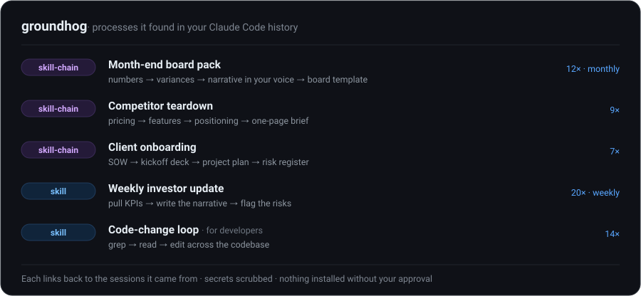

# groundhog

**Standing up a one-off automation is easy — anyone can one-shot that in Claude or Codex. The hard part is the multi-step business processes you have quietly refined across dozens of sessions: the month-end board pack, the per-client onboarding run, the competitor teardown. groundhog finds those in your own Claude Code history and turns each into a skill-chain you invoke by name — the steps, the sequence, and the judgment, captured. (Developer workflows too.)**

[](https://github.com/Jbroad1/groundhog/actions/workflows/test.yml)
[](https://www.python.org/downloads/)
[](#why-zero-setup-friction)
[](LICENSE)


<p align="center">
  
</p>

groundhog is a Claude Code skill that reads your local `~/.claude` history and finds the workflows you have actually built up and repeated — not throwaway prompts, but the multi-step processes you have refined over time: the research-to-report pipeline, the onboarding sequence, the review-and-summarize loop you run every week. It turns each into a reusable skill or **skill-chain** that carries your steps and your judgment, so you stop re-deriving the same process from scratch. Every suggestion cites a proof-path to the sessions it came from, secrets are scrubbed before anything is written, and nothing is installed until you approve it.

Picture month-end. You pull the numbers, reconcile them against plan, write the variance commentary in your own voice, sanity-check the outliers, and drop it all into the board template — the same nine steps every month for a year, each with hard-won little rules about what to flag and how to phrase it. groundhog finds that process in your history and turns it into a `month-end-board-pack` skill-chain: one instruction, your nine steps, your format. The same goes for the `grep → read → edit` loop a developer runs across a codebase.

> Named for the day you keep reliving. groundhog is how you stop redoing it.

## What groundhog captures

"Make me an automation" is a single prompt — you do not need groundhog for that. groundhog is for the **multi-step processes you repeat and have quietly optimized** across many sessions, where the value is in the accumulated steps and judgment, not the one-liner:

**Business and operations**
- **Recurring reports as a pipeline** — pull the numbers, explain the variances, draft the narrative in your voice, format it into your template. Month-end board packs, weekly investor updates, QBR decks.
- **Per-entity workflows you run over and over** — a competitor teardown (pricing → features → positioning → brief), client onboarding (SOW → kickoff deck → project plan → risk register), an RFP answered section by section.
- **Research to decision** — structured multi-source research collapsed into your fixed report format: market scans, due-diligence memos, vendor comparisons.
- **Review loops** — contract or document review that pulls the key terms, flags deviations from your standard, and summarizes, the same way every time.

**Engineering**
- Repeated tool sequences (grep → read → edit), edit hotspots, and multi-step plans become skills and skill-chains; guardrail commands (tests, linters) become hooks.

Each becomes a **skill-chain** (the multi-step ones) or a **skill** you invoke by name — carrying the steps and judgment you would otherwise re-explain every time. groundhog scores each candidate, dedups it against what you already have, and you decide what to build.

## See it work

Point groundhog at the bundled sample data. No `~/.claude` required:

```bash
python scripts/groundhog.py scan --config-dir assets/fixtures/sample-config --since all
```

```
  sources: history=6 prompts, transcripts=9 sessions (9 parsed, 0 cached), plans=2
  existing automations: 1 skills, 1 hooks
  9 candidates. Top 9:
    [   9.60] skill        edit-hotspot       Edit hotspot: src/app.py
    [   5.60] skill        tool-sequence      Grep -> Read -> Edit
    [   4.50] skill-chain  plan-type          Recurring plan type: refactor the auth module
    [   3.25] skill        prompt-cluster     Recurring request: please deploy the app with token=[RED
    [   3.20] hookify-rule bash-template      Recurring command: pytest tests/ -q  [managed-hook warning]
    [   2.25] hookify-rule error-fix          Error->fix: Bash fails, then Edit  [managed-hook warning]
    [   2.10] skill        tool-sequence      Bash -> Edit
    [   1.02] skill        repeated-call-loop Repeated Read loop (up to 4 in a row)
    [   0.00] skill        prompt-cluster     Recurring slash command: /deploy
```

This sample is a coding project, so most candidates are developer patterns — but look at the `skill-chain` row (`plan-type`): that is a **recurring multi-step process**, the kind groundhog turns into a chain you invoke once, exactly like a month-end board pack or an onboarding run. The `prompt-cluster` rows are the single-step version. Two other touches: the secret in the deploy prompt is redacted inline to `[RED…`, and `/deploy` scores `0.00` because you already automated it — groundhog will not tell you to build it twice.

## Getting started

**The easy way — ask Claude:**

> "Look through my Claude Code history and turn the things I keep repeating into skills I can reuse."

Claude runs the whole loop: it scans your history, ranks what is worth automating, shows you the candidates with their evidence, builds the ones you pick, and installs only those. Add "just do it, top 3" to let it auto-select.

**Prefer the command line?**

```bash
python scripts/preflight.py                   # check your environment and policy
python scripts/groundhog.py scan --since 30d  # mine the last 30 days → scan.json
```

## Installing groundhog

```bash
# Via skills.sh — pulls straight from GitHub:
npx skills add Jbroad1/groundhog -g          # → ~/.claude/skills/groundhog

# Or clone into your Claude Code skills directory:
git clone https://github.com/Jbroad1/groundhog ~/.claude/skills/groundhog

# Or run the installer from a clone (copies in, skipping VCS/build cruft):
./install.sh          # macOS / Linux
pwsh ./install.ps1    # Windows
```

## Why zero setup friction

groundhog is pure Python standard library and Claude Code, nothing else. No `jq`, no `pip install`, no external framework to set up. The only requirement is Python 3.8+ on your PATH, which Claude Code users already have. It reads native Windows paths (`C:\Users\…`) and POSIX paths (`/home/…`) the same way, and CI runs the whole suite on Python 3.8 through 3.14 across Linux, macOS, and Windows.

## How it works

groundhog runs as seven phases. The mechanical work is plain scripts; the judgment calls go to Claude, and you approve anything before it is built.

| Phase | What happens | Runs as |
|---|---|---|
| 0 · Preflight | Find your config dir; detect your OS, Python, and the `allowManagedHooksOnly` policy. | script |
| 1 · Scan | Read your history, session transcripts, and plans into a scored, scrubbed `scan.json` with proof-paths. Incremental on re-runs. | script |
| 2 · Analyze | Cluster the candidates, check them against what you already have, and pick the right automation for each. | Claude |
| 3 · Propose | Show you the ranked candidates for approval; `--yes` auto-selects the top ones. | you decide |
| 4 · Build | Author each chosen automation test-first, so it works before it lands. | Claude + script |
| 5 · Check | Validate every emitted skill or hook and re-check for duplicates. | script |
| 6 · Install | Write the approved automations and record a manifest for next time. | you decide |

Deeper detail lives in [references/data-formats.md](references/data-formats.md) and [references/primitive-selection.md](references/primitive-selection.md).

## Is my data safe?

Yes, with one caveat. groundhog runs entirely on your machine and makes no network calls, so your prompts, transcripts, and plans never leave your computer.

Before anything is written, groundhog redacts common secret *shapes* from every string: API keys, tokens, JWTs, private keys, credentials in URLs and connection strings, and `key=value` secrets. This is best-effort, not a guarantee. A bare, high-entropy token with no keyword and no recognizable prefix can slip through.

`scan.json` also records local filesystem paths, including your home directory and project locations, which contain your username. None of that is a secret, but it identifies your machine. **Read `scan.json` before you share it.** A redactor you trust blindly is worse than one you check.

## FAQ

**What is groundhog?**
groundhog is a Claude Code skill that reads your local `~/.claude` history, finds the tasks you repeat, and turns each into a reusable skill, hook, or skill-chain. It runs on your machine and installs nothing without your approval.

**Do I need to be a developer to use it?**
No. If you use Claude Code for research, writing, analysis, or operations, groundhog finds the requests you repeat and turns them into one-step skills. You do need Claude Code installed, and you talk to it in plain English.

**What kinds of tasks can groundhog automate?**
Multi-step business processes you repeat: month-end reporting pipelines, competitor teardowns, client onboarding runs, RFP responses, research-to-report workflows, and recurring document review. For developers it also covers repeated tool sequences, edit hotspots, multi-step plans, and test or lint guardrails.

**How is groundhog different from continuous-learning tools?**
Most tools learn forward from new sessions only. groundhog works retroactively: it mines the history you have already built up, so it has useful suggestions on the first run instead of after weeks of fresh data.

**Does groundhog send my data anywhere?**
No. groundhog reads and writes only local files under your Claude Code config directory and makes no network calls. Your data stays on your machine, and the analysis stays on disk until you choose to share it.

**Is groundhog safe to run?**
Yes. groundhog mines read-only and writes no automations on its own. It previews every skill or hook and installs only what you approve. Secrets are scrubbed from its output on a best-effort basis before anything lands in `scan.json`.

**Does it work with Codex or other assistants?**
Not yet. groundhog reads Claude Code's local data format today. Other assistants store their history differently and would need a separate adapter.

**Does it work on Windows?**
Yes. groundhog handles native Windows paths such as `C:\Users\…` alongside POSIX paths like `/home/…`. The suite runs on Windows, macOS, and Linux in CI, so behavior is verified on all three.

**What is a proof-path?**
A proof-path is the exact file, line, and session a suggestion came from. Every candidate carries one, so you can open the evidence and confirm a pattern is real before building an automation for it.

## For developers

Under the business framing, groundhog is a full workflow miner for engineering sessions. It reads your session transcripts (including nested `subagents/*.jsonl`) and picks the automation primitive that fits each pattern:

- **Skill** — a repeatable task that needs judgment: a recurring tool sequence (`grep → read → edit`), an edit hotspot, a repeated-call loop.
- **Hook** — a deterministic guardrail that must fire on an event: the `pytest` or lint command you run after every change.
- **Skill-chain** — a recurring multi-step plan you have green-lit before.

It scores by leverage, attaches a proof-path to every candidate, and dedups against the skills and hooks you already have. It is also **managed-policy aware**: when `allowManagedHooksOnly` is set, groundhog does not create settings hooks that would silently never fire — it emits a runtime-read hookify rule or refuses with a warning. See [references/managed-hooks.md](references/managed-hooks.md) and [references/primitive-selection.md](references/primitive-selection.md).

## How groundhog compares

Two projects address this idea. **continuous-learning-v2** learns forward from new sessions and never looks at the history you already have. **crune** turns logs into a skill-synthesis dashboard and outputs skills only. groundhog covers the space between them: retroactive mining, three output primitives, test-first authoring, and a scrubbed, policy-aware, review-by-default finish, in one standalone skill. See [CREDITS.md](CREDITS.md) for the ideas these inspired.

## Project layout

```
groundhog/
  SKILL.md                 # the skill itself (writing-skills format)
  scripts/                 # pure-Python engine (no jq, native paths)
    groundhog.py               # CLI: preflight | scan | validate-* | package | install
    groundhog_lib.py           # shared helpers (streaming, normalization, inventory)
    preflight.py  scrub.py
    scan_history.py  scan_transcripts.py  scan_plans.py  mine_workflows.py
    validate_skill.py  validate_hook.py  package_skill.py
  references/              # data formats, primitive selection, managed hooks, authoring
  agents/analyzer.md       # scan.json → ranked verdict.json
  assets/fixtures/         # sample data for the demo and tests
  tests/                   # stdlib unittest suite (engine, scanners, validators, CLI)
  evals/evals.json         # trigger + application evals
  LICENSE  README.md  CREDITS.md
```

## Development

```bash
python -m unittest discover -s tests -v     # full suite: engine, scanners, validators, CLI
python evals/run_evals.py                    # deterministic eval gate (a1–a8)
python -m compileall scripts tests evals     # byte-compile smoke check
python scripts/groundhog.py scan --since 30d # real-data, read-only smoke run
```

## License

MIT © 2026 Joshua Broad. See [LICENSE](LICENSE) and [CREDITS.md](CREDITS.md).

<sub>Keywords: Claude Code, Claude Code skill, business workflow automation, automate recurring tasks, market research automation, recurring reports, agent skills, no-code automation for Claude, workflow mining, developer workflow automation, hooks, skill-chain. Last updated: July 2026.</sub>
